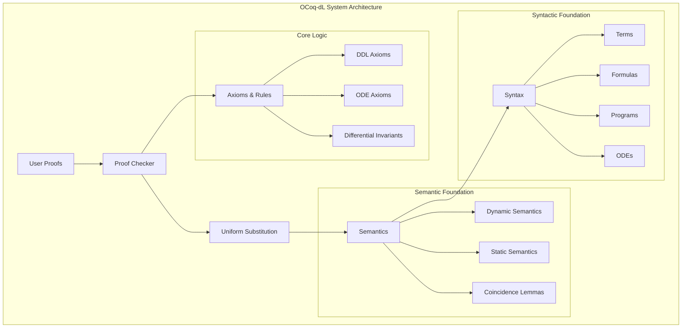
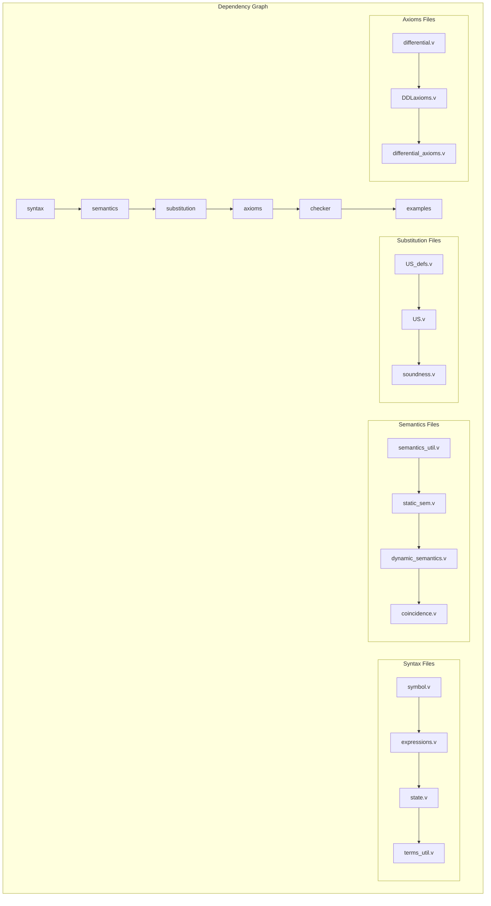
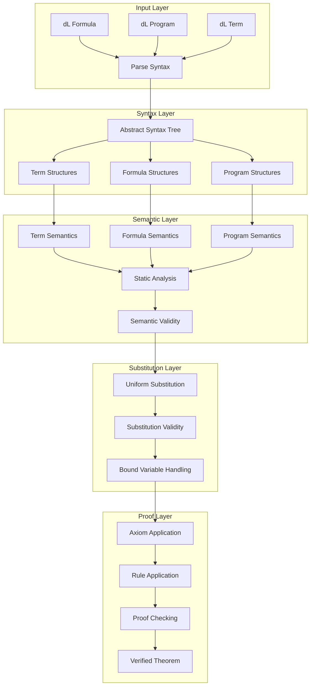
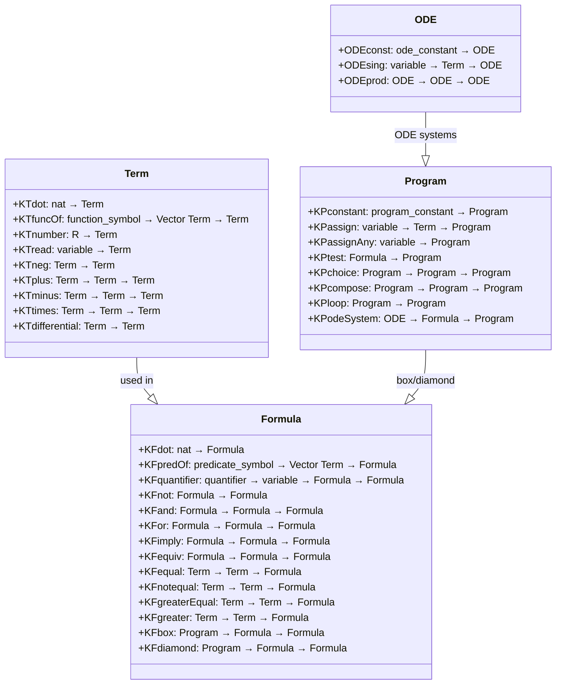
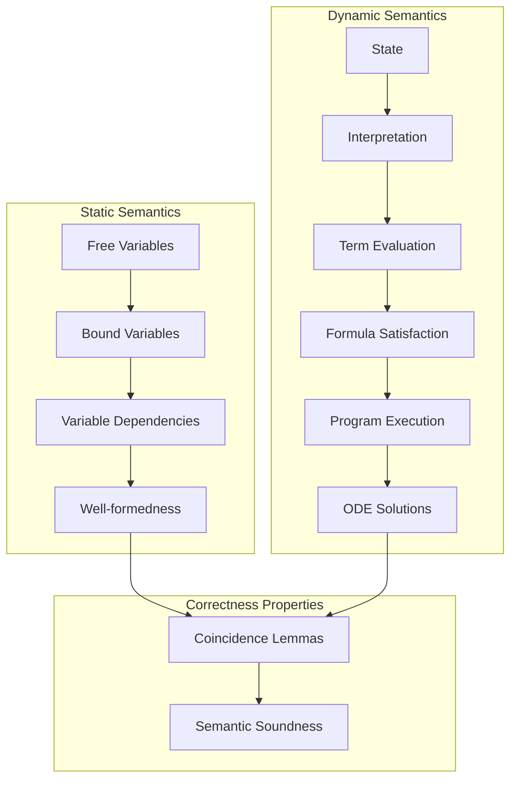
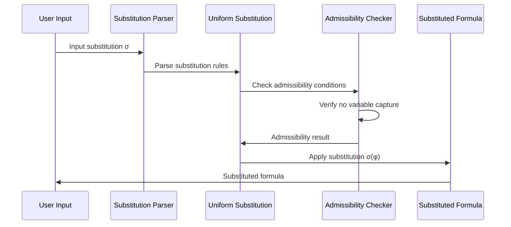
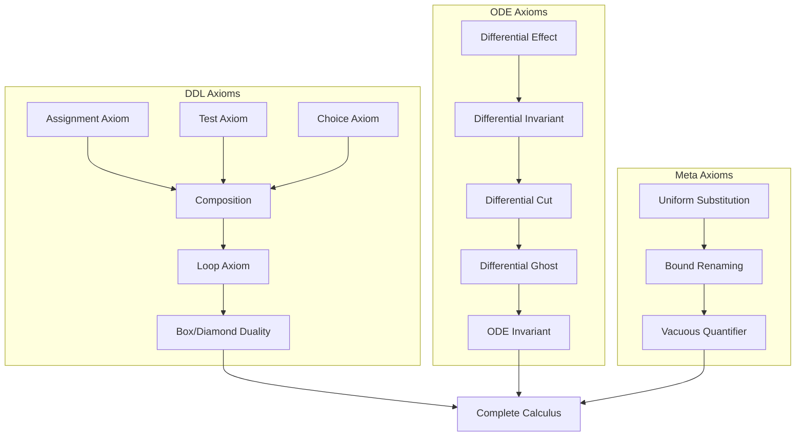
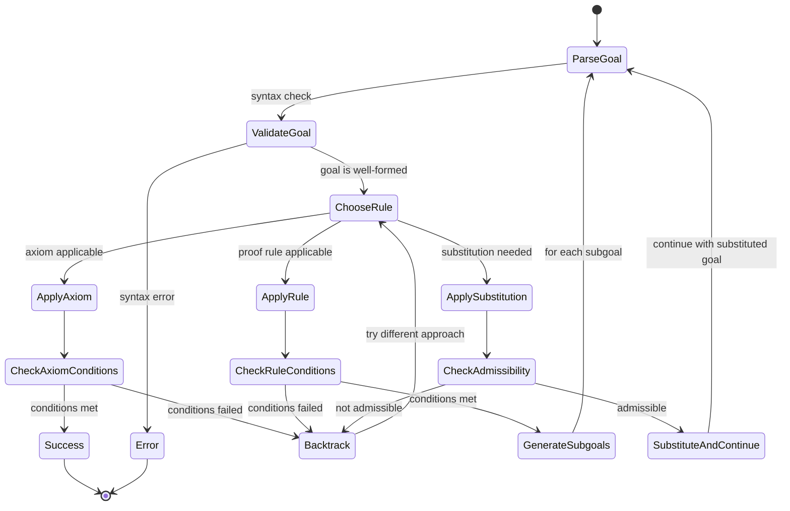
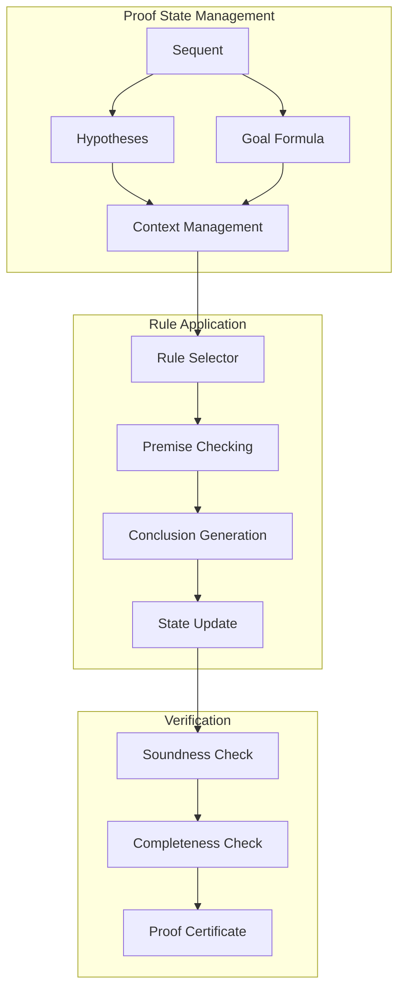
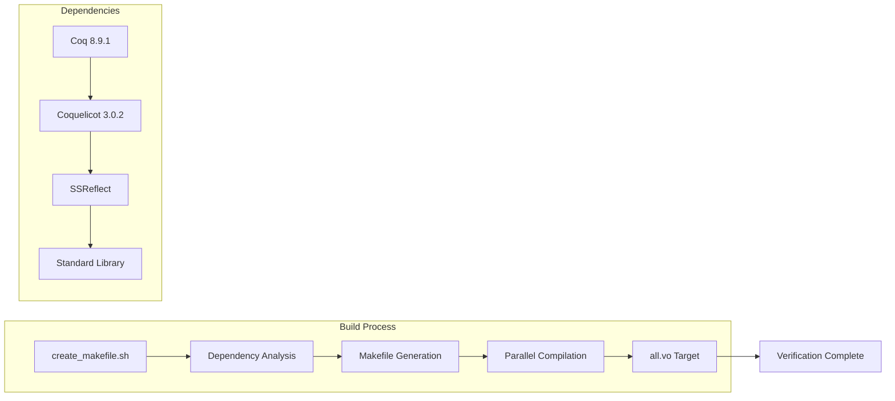

# OCoq-dL Technical Architecture Documentation

## Table of Contents

1. [System Overview](#system-overview)
2. [Architecture Components](#architecture-components)
3. [Module Dependencies](#module-dependencies)
4. [Data Flow](#data-flow)
5. [Core Components](#core-components)
6. [Proof Workflow](#proof-workflow)
7. [Extension Guidelines](#extension-guidelines)
8. [Build System](#build-system)

## System Overview

OCoq-dL is a formal verification system that implements differential dynamic logic (dL) in Coq. It provides a complete formalization of KeYmaeraX's core, including syntax, semantics, uniform substitution, axioms, and a proof checker for differential dynamic logic.



## Architecture Components

The system is organized into seven main modules, each with specific responsibilities:

### 1. Syntax Module
**Location**: `syntax/`  
**Purpose**: Defines the abstract syntax trees for differential dynamic logic

### 2. Semantics Module  
**Location**: `semantics/`  
**Purpose**: Implements static and dynamic semantics for dL constructs

### 3. Substitution Module
**Location**: `substitution/`  
**Purpose**: Implements uniform substitution and proves its correctness

### 4. Axioms Module
**Location**: `axioms/`  
**Purpose**: Contains DDL axioms, ODE axioms, and differential invariant rules

### 5. Checker Module
**Location**: `checker/`  
**Purpose**: Implements sequent calculus and proof verification

### 6. Examples Module
**Location**: `examples/`  
**Purpose**: Provides example proofs and verification cases

### 7. Utilities Module
**Location**: `coq-tools/`  
**Purpose**: Contains utility tactics and helper functions

## Module Dependencies



## Data Flow

The following diagram shows how data flows through the system from syntax to verified proofs:



## Core Components

### Syntax Component (`syntax/`)

The syntax module defines the fundamental structures of differential dynamic logic.



### Semantics Component (`semantics/`)



### Substitution Component (`substitution/`)

The uniform substitution system is central to the calculus:



### Axioms Component (`axioms/`)



## Proof Workflow

The proof construction and verification follows a structured workflow:



### Proof Checker Architecture



## Extension Guidelines

### Adding New Axioms

1. Define the axiom in `axioms/DDLaxioms.v` or `axioms/differential_axioms.v`
2. Prove soundness with respect to the semantics
3. Add the axiom to the proof checker in `checker/checker.v`
4. Create examples demonstrating usage

### Adding New Language Constructs

1. Extend syntax in `syntax/expressions.v`
2. Define semantics in `semantics/dynamic_semantics.v` and `semantics/static_sem.v`
3. Extend uniform substitution in `substitution/US.v`
4. Prove coincidence lemmas in `semantics/coincidence.v`
5. Add corresponding axioms if needed

### Extending the Proof Checker

1. Define new proof rules in appropriate axiom files
2. Implement rule application logic in `checker/checker.v`
3. Prove soundness of new rules
4. Add examples and tests

## Build System

The project uses a custom build system based on Coq's dependency analysis:



### Build Commands

```bash
# Generate Makefile and build
./create_makefile.sh
make -j <cores>

# Clean build artifacts
make clean

# Build specific component
make syntax/expressions.vo
```

The architecture supports modular development and verification, with clear separation of concerns between syntax, semantics, substitution, axioms, and proof checking. Each component builds upon the previous ones, creating a layered architecture that ensures correctness at each level.