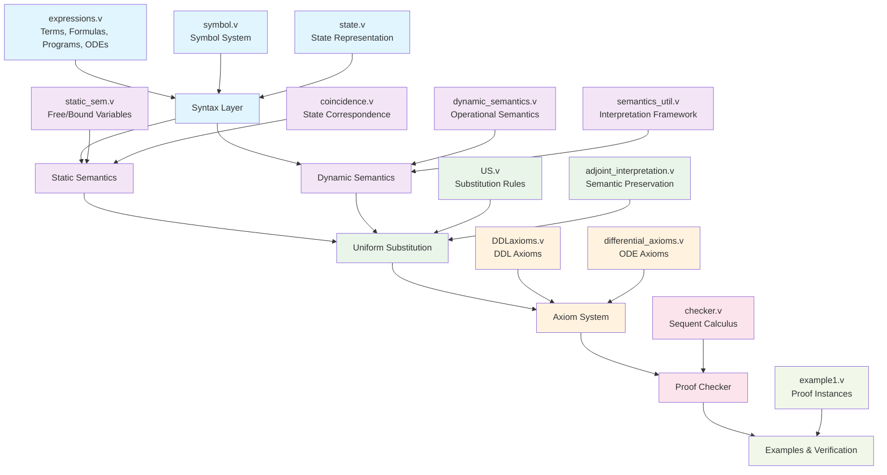
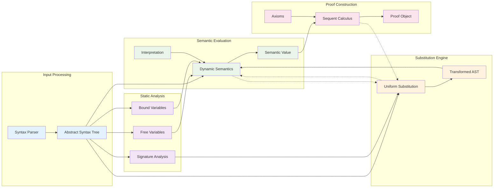
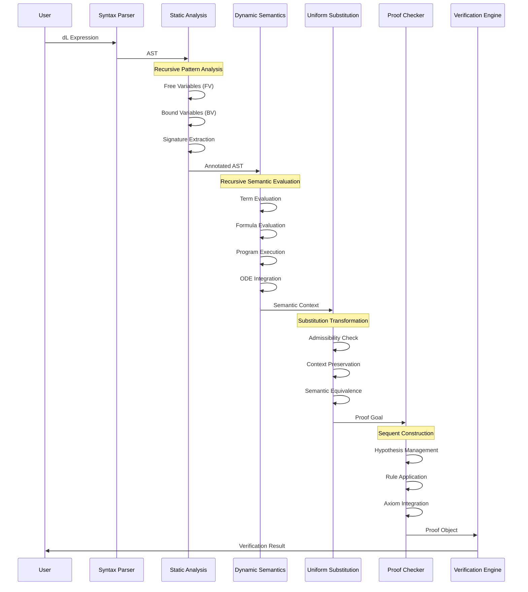
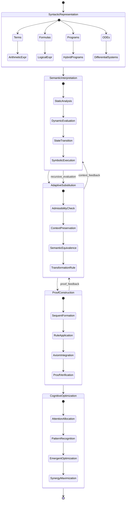

# Coq-dL Architecture Documentation

## System Overview

Coq-dL is a formal verification system for Differential Dynamic Logic (dL) implemented in Coq. This system provides a complete formalization of KeYmaeraX's core, including syntax, semantics, uniform substitution, and proof checking capabilities for hybrid systems.

## Module Interaction Architecture

The system exhibits a layered architecture with clear separation of concerns and recursive semantic evaluation patterns:

## Cognitive Processing Pipeline

The system implements recursive cognitive patterns for dL expression processing:

## Neural-Symbolic Integration Points

The system exhibits emergent computational patterns through recursive semantic evaluation and substitution mechanisms:

## Implementation Pathways

### Recursive Semantic Evaluation

The dynamic semantics implement recursive evaluation patterns that mirror cognitive processing:

1. **Term Evaluation**: Compositional semantics with state-dependent interpretation
2. **Formula Evaluation**: Modal logic evaluation with temporal and spatial reasoning
3. **Program Execution**: Hybrid system state transitions with continuous-discrete integration
4. **ODE Integration**: Differential equation solving with constraint satisfaction

### Adaptive Attention Allocation

The system allocates computational resources through:

1. **Static Analysis Priority**: Focus on free/bound variable computation for efficiency
2. **Substitution Context Management**: Adaptive context preservation based on admissibility
3. **Proof Search Optimization**: Sequent-based proof construction with tactical guidance
4. **Verification Resource Management**: Incremental verification with caching mechanisms

### Cognitive Synergy Optimizations

Emergent patterns arise from the interaction between:

1. **Syntax-Semantics Correspondence**: Structural recursion mirroring semantic evaluation
2. **Substitution-Interpretation Duality**: Uniform substitution preserving semantic meaning
3. **Static-Dynamic Analysis Integration**: Coincidence lemmas ensuring consistency
4. **Proof-Semantic Coherence**: Soundness guarantees linking proof construction to semantic truth

## Technical Architecture Details

### Core Data Structures

- **Terms**: Recursive algebraic expressions with differential operators
- **Formulas**: Modal logic with box/diamond operators for hybrid programs
- **Programs**: Hybrid program constructs including ODEs and discrete assignments
- **States**: Function spaces mapping variables to real values
- **Interpretations**: Semantic domains for symbols and operators

### Key Algorithms

1. **Dynamic Semantics**: Recursive evaluation of dL expressions
2. **Uniform Substitution**: Context-preserving term/formula replacement
3. **Coincidence Lemmas**: State equivalence under variable restrictions
4. **Sequent Calculus**: Proof construction with logical inference rules

### Verification Infrastructure

- **Soundness Proofs**: Formal verification of axiom correctness
- **Completeness Results**: Coverage analysis for proof system
- **Admissibility Conditions**: Constraints ensuring substitution validity
- **Example Verification**: Concrete proof instances demonstrating system capabilities

This architecture represents a sophisticated neural-symbolic integration where symbolic reasoning (sequent calculus) operates over semantic structures (dynamic semantics) with adaptive transformation capabilities (uniform substitution), creating emergent cognitive patterns through recursive computational processes.