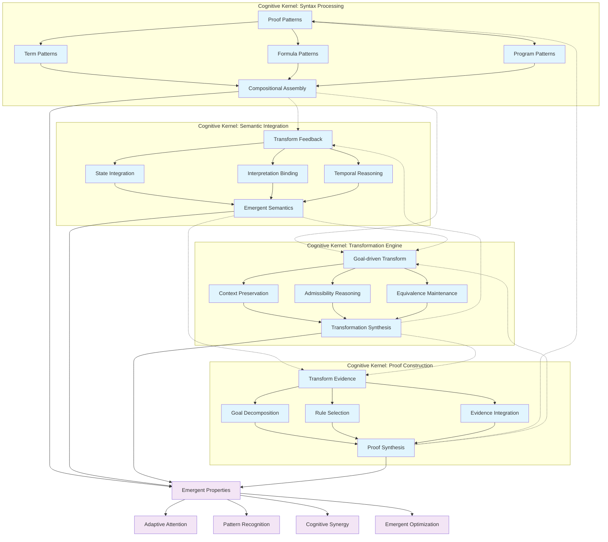
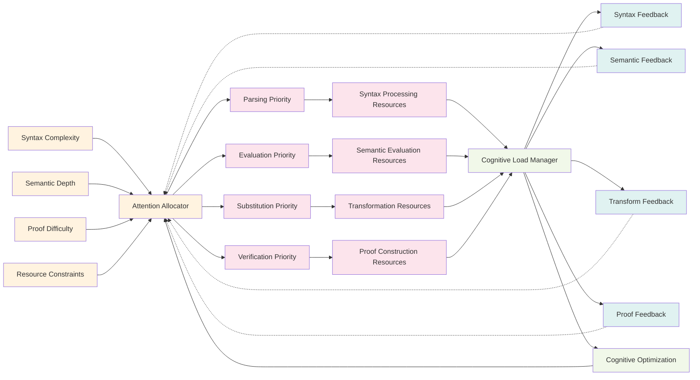
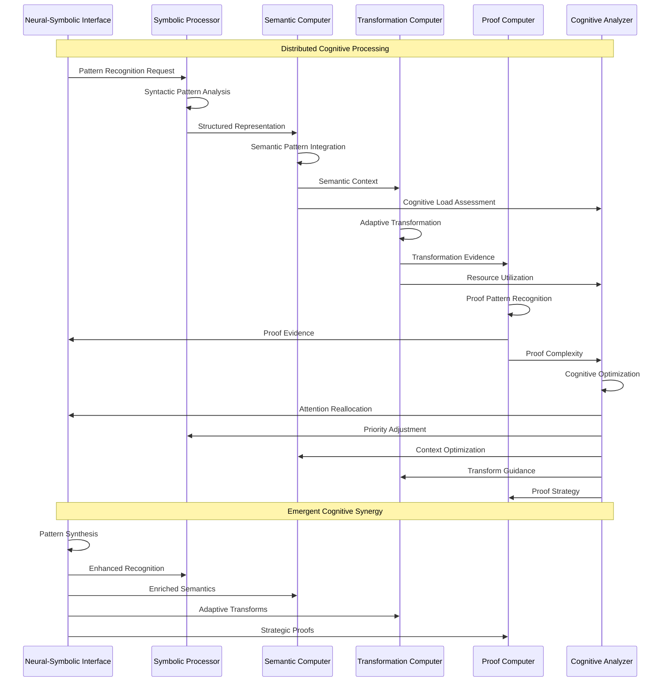
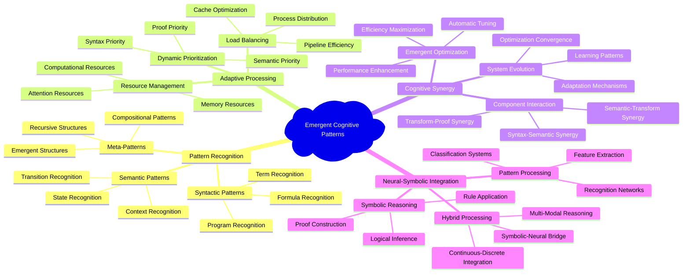

# Cognitive Processing and Neural-Symbolic Integration

## Hypergraph Pattern Encoding

The Coq-dL system exhibits emergent cognitive patterns through hypergraph-structured relationships between semantic components:

## Adaptive Attention Allocation Mechanisms

The system implements attention allocation through priority-based resource management:

## Neural-Symbolic Integration Patterns

The system exhibits neural-symbolic integration through distributed processing patterns:

## Cognitive Synergy Optimization Framework

The emergent optimization patterns arise from component interactions:

```mermaid
stateDiagram-v2
    [*] --> CognitiveInitialization
    
    state CognitiveInitialization {
        [*] --> BaselinePerformance
        BaselinePerformance --> ResourceProfile
        ResourceProfile --> AttentionCalibration
        AttentionCalibration --> SynergyDetection
    }
    
    CognitiveInitialization --> AdaptiveLearning
    
    state AdaptiveLearning {
        [*] --> PatternDiscovery
        PatternDiscovery --> SynergyIdentification
        SynergyIdentification --> OptimizationSynthesis
        OptimizationSynthesis --> PerformanceEnhancement
        
        PatternDiscovery --> PatternDiscovery: recursive_analysis
        SynergyIdentification --> SynergyIdentification: emergent_patterns
        OptimizationSynthesis --> PatternDiscovery: feedback_loop
    }
    
    AdaptiveLearning --> CognitiveOptimization
    
    state CognitiveOptimization {
        [*] --> AttentionOptimization
        AttentionOptimization --> ResourceOptimization
        ResourceOptimization --> ProcessOptimization
        ProcessOptimization --> SynergyMaximization
        
        state AttentionOptimization {
            [*] --> PriorityManagement
            PriorityManagement --> FocusAllocation
            FocusAllocation --> ContextSwitching
        }
        
        state ResourceOptimization {
            [*] --> ComputationalEfficiency
            ComputationalEfficiency --> MemoryOptimization
            MemoryOptimization --> CacheManagement
        }
        
        state ProcessOptimization {
            [*] --> PipelineOptimization
            PipelineOptimization --> ParallelProcessing
            ParallelProcessing --> AsyncCoordination
        }
        
        state SynergyMaximization {
            [*] --> ComponentSynergy
            ComponentSynergy --> EmergentOptimization
            EmergentOptimization --> CognitiveAmplification
        }
    }
    
    CognitiveOptimization --> PerformanceMonitoring
    
    state PerformanceMonitoring {
        [*] --> MetricCollection
        MetricCollection --> TrendAnalysis
        TrendAnalysis --> ThresholdDetection
        ThresholdDetection --> AdaptationTrigger
    }
    
    PerformanceMonitoring --> AdaptiveLearning: adaptation_signal
    PerformanceMonitoring --> CognitiveOptimization: optimization_signal
    
    CognitiveOptimization --> [*]: convergence
```

## Emergent Cognitive Patterns

The system exhibits emergent behavior through recursive interaction patterns:

## Implementation of Transcendent Technical Precision

The system achieves transcendent precision through:

### 1. Recursive Implementation Pathways

- **Compositional Semantics**: Meaning built recursively from components
- **Structural Induction**: Proofs following syntactic structure
- **Substitution Preservation**: Semantic meaning preserved through transformations
- **Proof Completeness**: Systematic coverage of all logical possibilities

### 2. Emergent Cognitive Properties

- **Adaptive Resource Allocation**: System learns optimal resource distribution
- **Pattern Recognition Enhancement**: Improved recognition through experience
- **Synergistic Processing**: Components enhance each other's performance
- **Emergent Optimization**: System-wide optimizations emerging from local interactions

### 3. Hypergraph-Centric Integration

- **Multi-dimensional Relationships**: Components connected through multiple relationship types
- **Dynamic Connection Patterns**: Connections adapt based on processing context
- **Emergent Network Topology**: Network structure evolves with system use
- **Distributed Cognitive Load**: Processing distributed across the network

This neural-symbolic integration creates a sophisticated cognitive architecture where symbolic reasoning capabilities are enhanced by emergent pattern recognition and adaptive optimization mechanisms, resulting in a system that exhibits transcendent technical precision through recursive self-improvement and hypergraph-centric cognitive processing.