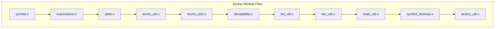
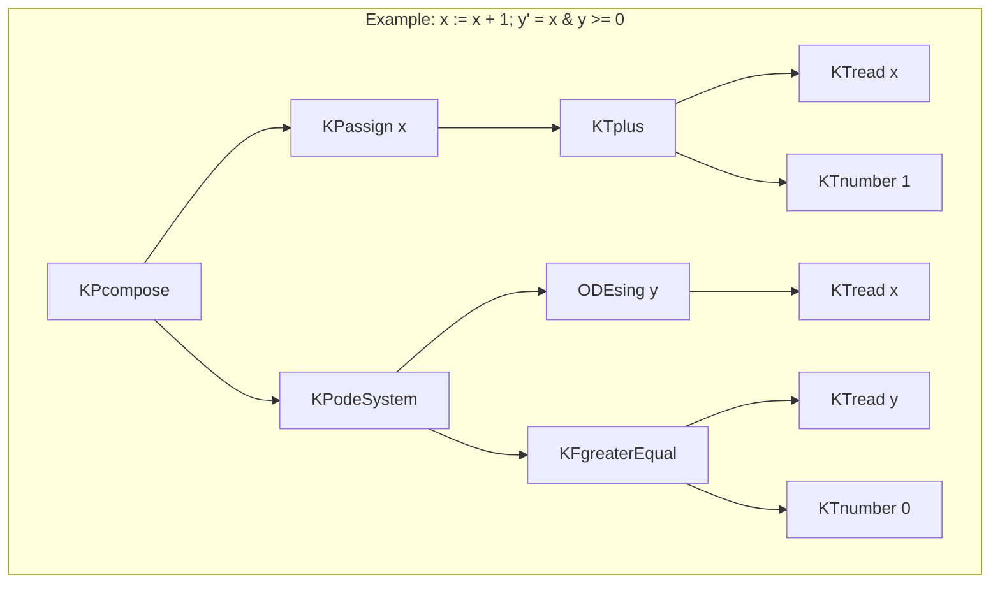
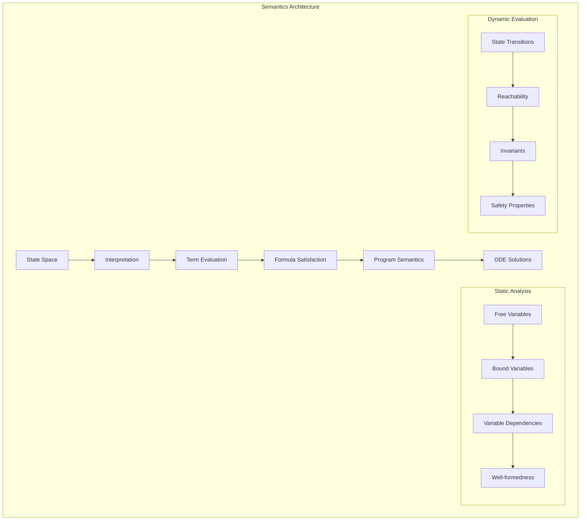
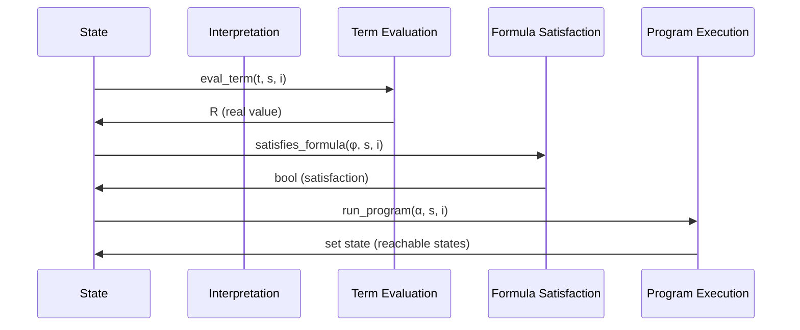
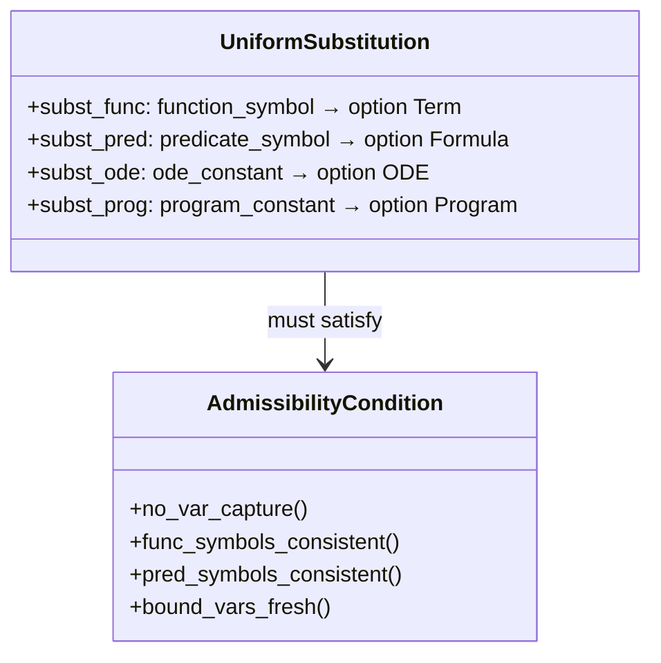
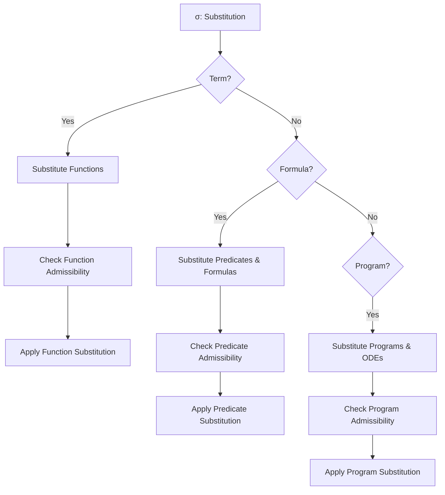
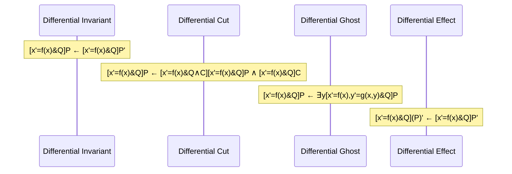
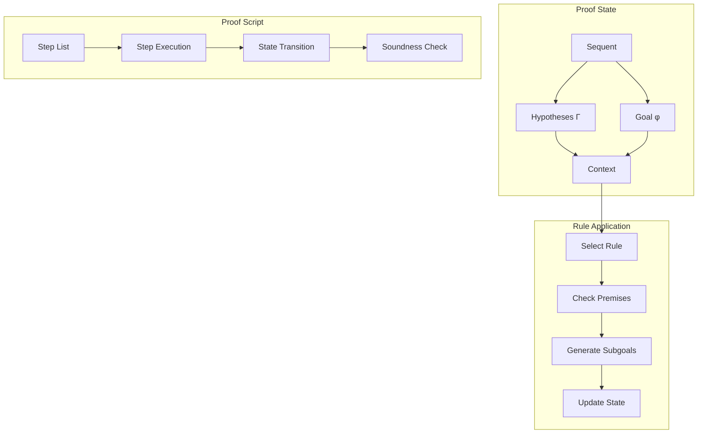
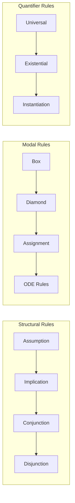

# Component Reference Documentation

## Table of Contents

1. [Syntax Module](#syntax-module)
2. [Semantics Module](#semantics-module)
3. [Substitution Module](#substitution-module)
4. [Axioms Module](#axioms-module)
5. [Checker Module](#checker-module)
6. [Examples Module](#examples-module)

## Syntax Module

### Overview
The syntax module (`syntax/`) defines the abstract syntax trees for all differential dynamic logic constructs.

### File Structure



### Key Data Types

#### Terms
```coq
Inductive Term : Type :=
| KTdot       : nat -> Term
| KTfuncOf    : function_symbol -> Vector.t Term (func_arity f) -> Term  
| KTnumber    : R -> Term
| KTread      : variable -> Term
| KTneg       : Term -> Term
| KTplus      : Term -> Term -> Term
| KTminus     : Term -> Term -> Term
| KTtimes     : Term -> Term -> Term
| KTdifferential : Term -> Term
```

#### Formulas
```coq
Inductive Formula : Type :=
| KFdot         : nat -> Formula
| KFpredOf      : predicate_symbol -> Vector.t Term (pred_arity p) -> Formula
| KFquantifier  : quantifier -> variable -> Formula -> Formula
| KFnot         : Formula -> Formula
| KFand         : Formula -> Formula -> Formula
| KFor          : Formula -> Formula -> Formula
| KFimply       : Formula -> Formula -> Formula
| KFequiv       : Formula -> Formula -> Formula
| KFequal       : Term -> Term -> Formula
| KFnotequal    : Term -> Term -> Formula
| KFgreaterEqual: Term -> Term -> Formula
| KFgreater     : Term -> Term -> Formula
| KFbox         : Program -> Formula -> Formula
| KFdiamond     : Program -> Formula -> Formula
```

#### Programs
```coq
Inductive Program : Type :=
| KPconstant   : program_constant -> Program
| KPassign     : variable -> Term -> Program
| KPassignAny  : variable -> Program
| KPtest       : Formula -> Program
| KPchoice     : Program -> Program -> Program
| KPcompose    : Program -> Program -> Program
| KPloop       : Program -> Program
| KPodeSystem  : ODE -> Formula -> Program
```

#### ODEs
```coq
Inductive ODE : Type :=
| ODEconst : ode_constant -> ODE
| ODEsing  : variable -> Term -> ODE
| ODEprod  : ODE -> ODE -> ODE
```

### Syntax Tree Visualization



## Semantics Module

### Overview
The semantics module (`semantics/`) implements both static and dynamic semantics for differential dynamic logic.

### Architecture



### Key Components

#### State Space
- **States**: `state = variable -> R`
- **Interpretations**: `interpretation` containing function and predicate symbols
- **Extended Interpretations**: Handle differential symbols

#### Dynamic Semantics Functions



### Coincidence Lemmas

The coincidence lemmas establish that semantic evaluation only depends on relevant variables:

```mermaid
graph LR
    A[Formula φ] --> B[Free Variables FV(φ)]
    B --> C[States s1, s2]
    C --> D{s1 =FV(φ) s2}
    D -->|Yes| E[s1 ⊨ φ ↔ s2 ⊨ φ]
    D -->|No| F[No Guarantee]
```

## Substitution Module

### Overview
The substitution module (`substitution/`) implements uniform substitution, which is the key mechanism for axiom instantiation in differential dynamic logic.

### Uniform Substitution Architecture

```mermaid
graph TB
    subgraph "Substitution Pipeline"
        A[Input Formula] --> B[Parse Substitution σ]
        B --> C[Check Admissibility]
        C --> D{Admissible?}
        D -->|Yes| E[Apply Substitution]
        D -->|No| F[Reject]
        E --> G[Output Formula σ(φ)]
    end
    
    subgraph "Admissibility Conditions"
        H[No Variable Capture] --> I[Bound Variable Fresh]
        I --> J[Function Symbol Consistent]
        J --> K[Predicate Symbol Consistent]
    end
    
    C --> H
```

### Substitution Types



### Substitution Process



## Axioms Module

### Overview
The axioms module (`axioms/`) contains the complete axiomatization of differential dynamic logic.

### Axiom Hierarchy

```mermaid
graph TB
    subgraph "Core DDL Axioms"
        A[Assignment [x:=t]φ ↔ φ_x^t] --> E[Composition [α;β]φ ↔ [α][β]φ]
        B[Test [?ψ]φ ↔ ψ→φ] --> E
        C[Choice [α∪β]φ ↔ [α]φ∧[β]φ] --> E
        D[Loop [α*]φ ↔ φ∧[α][α*]φ] --> E
        E --> F[Modal Axioms]
    end
    
    subgraph "ODE Axioms"
        G[Differential Effect DE] --> H[Differential Invariant DI]
        H --> I[Differential Cut DC]
        I --> J[Differential Ghost DG]
        J --> K[Differential Weakening DW]
    end
    
    subgraph "Meta Axioms"
        L[Uniform Substitution US] --> M[Bound Renaming BR]
        M --> N[Vacuous Quantifier VQ]
    end
    
    F --> O[Complete Calculus]
    K --> O
    N --> O
```

### ODE Axiom Details



## Checker Module

### Overview
The checker module (`checker/`) implements a sequent calculus proof checker for differential dynamic logic.

### Proof State Architecture



### Proof Rules



## Examples Module

### Overview
The examples module (`examples/`) provides concrete proofs demonstrating the use of the proof checker.

### Example Structure

```mermaid
graph TB
    subgraph "Example 1: Safety Property"
        A[v≥0∧A≥0] --> B[Safety Proof]
        B --> C[[x'=v,v'=A&true] v≥0]
    end
    
    subgraph "Example 2: Differential Invariant"
        D[x²+y²=1] --> E[DI Proof]
        E --> F[[x'=-y,y'=x&true] x²+y²=1]
    end
    
    subgraph "Proof Steps"
        G[step_imply_right] --> H[step_and_left]
        H --> I[step_DIgeD]
        I --> J[step_OC]
        J --> K[step_assumption]
    end
```

### Proof Script Example

```coq
apply (apply_script_preserves_soundness
  [step_imply_right "x",
   step_and_left "x" "y", 
   step_DIgeD "z" [USE_function f, USE_pred p] [],
   step_assumption "x"]).
```

This component reference provides detailed documentation of each module's structure, key components, and interactions within the OCoq-dL system.