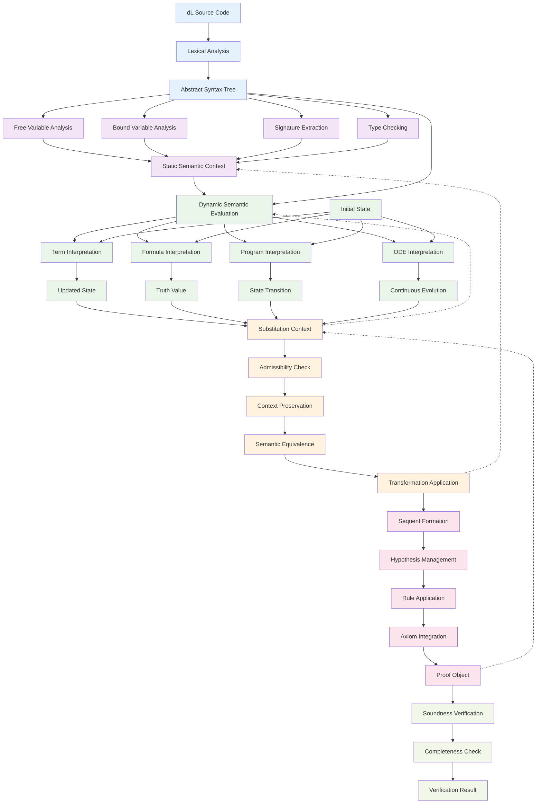
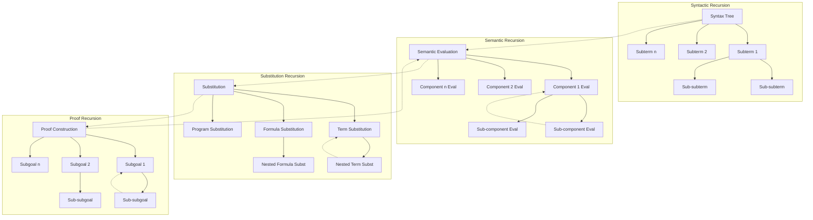

# Module Dependencies and Data Flow

## Module Dependency Graph

This diagram shows the detailed dependencies between all major modules in the Coq-dL system:

```mermaid
graph TD
    %% Foundation Layer
    subgraph "Foundation Layer"
        reals[reals_util.v<br/>Real Number Operations]
        list[list_util.v<br/>List Operations]
        vec[vec_util.v<br/>Vector Operations]
        tactics[tactics_util.v<br/>Proof Tactics]
    end
    
    %% Symbol System
    subgraph "Symbol System"
        symbol[symbol.v<br/>Symbol Definitions]
        symbol_lemmas[symbol_lemmas.v<br/>Symbol Properties]
        state[state.v<br/>State Representation]
    end
    
    %% Syntax Layer  
    subgraph "Syntax Layer"
        expressions[expressions.v<br/>Core AST]
        decidability[decidability.v<br/>Decision Procedures]
        terms_util[terms_util.v<br/>Term Utilities]
        terms_util2[terms_util2.v<br/>Advanced Term Ops]
    end
    
    %% Static Semantics
    subgraph "Static Semantics"
        free_vars[free_vars_term.v<br/>Free Variable Analysis]
        eassignables[eassignables.v<br/>Assignable Variables]
        fcset[fcset.v<br/>Finite Choice Sets]
        static_sem[static_sem.v<br/>Static Semantic Analysis]
        static_sem_lemmas[static_sem_lemmas.v<br/>Static Semantic Properties]
    end
    
    %% Dynamic Semantics
    subgraph "Dynamic Semantics"
        semantics_util[semantics_util.v<br/>Semantic Utilities]
        deriv_util[deriv_util.v<br/>Derivative Utilities]
        dynamic_semantics[dynamic_semantics.v<br/>Operational Semantics]
        dynamic_semantics_prop[dynamic_semantics_prop.v<br/>Semantic Properties]
        ext_interpretation[ext_interpretation.v<br/>Extended Interpretations]
        coincidence[coincidence.v<br/>Coincidence Lemmas]
        bound_effect[bound_effect.v<br/>Variable Binding Effects]
        composition[composition.v<br/>Semantic Composition]
        multiplication[multiplication.v<br/>Multiplication Semantics]
        division[division.v<br/>Division Semantics]
        faaDiBruno[faaDiBruno.v<br/>Faà di Bruno Formula]
    end
    
    %% Substitution System
    subgraph "Substitution System"
        US_defs[US_defs.v<br/>Substitution Definitions]
        US[US.v<br/>Uniform Substitution]
        US_lemmas[US_lemmas.v<br/>Substitution Lemmas]
        adjoint_interpretation[adjoint_interpretation.v<br/>Adjoint Interpretations]
        admissible_terms[admissible_terms.v<br/>Admissible Terms]
        eassignables_terms[eassignables_terms.v<br/>Assignable Term Analysis]
        eassignables_subterm[eassignables_subterm.v<br/>Subterm Analysis]
        lookup_lemmas[lookup_lemmas.v<br/>Lookup Properties]
        swapping[swapping.v<br/>Variable Swapping]
        bound_swapping[bound_swapping.v<br/>Bound Variable Swapping]
        soundness[soundness.v<br/>Substitution Soundness]
    end
    
    %% Axiom System
    subgraph "Axiom System"
        DDLaxioms[DDLaxioms.v<br/>DDL Axioms]
        differential[differential.v<br/>Differential Operations]
        differential_axioms[differential_axioms.v<br/>Differential Axioms]
        differential_invariant[differential_invariant.v<br/>Differential Invariants]
        integral[integral.v<br/>Integration Rules]
    end
    
    %% Proof System
    subgraph "Proof System"
        checker[checker.v<br/>Proof Checker]
    end
    
    %% Examples
    subgraph "Examples"
        example1[example1.v<br/>Basic Proof Example]
        example2[example2.v<br/>Advanced Proof Example]
        DI_and[DI_and.v<br/>Differential Invariant AND]
        DI_or[DI_or.v<br/>Differential Invariant OR]
    end
    
    %% Dependencies
    reals --> symbol
    list --> symbol
    vec --> symbol
    tactics --> symbol
    
    symbol --> expressions
    symbol_lemmas --> expressions
    state --> expressions
    
    expressions --> decidability
    expressions --> terms_util
    expressions --> terms_util2
    
    terms_util --> free_vars
    expressions --> eassignables
    list --> fcset
    eassignables --> static_sem
    fcset --> static_sem
    static_sem --> static_sem_lemmas
    
    expressions --> semantics_util
    reals --> deriv_util
    semantics_util --> dynamic_semantics
    deriv_util --> dynamic_semantics
    free_vars --> dynamic_semantics
    state --> dynamic_semantics
    dynamic_semantics --> dynamic_semantics_prop
    dynamic_semantics --> ext_interpretation
    static_sem_lemmas --> coincidence
    dynamic_semantics --> coincidence
    ext_interpretation --> coincidence
    coincidence --> bound_effect
    dynamic_semantics --> composition
    dynamic_semantics --> multiplication
    dynamic_semantics --> division
    deriv_util --> faaDiBruno
    
    static_sem --> US_defs
    US_defs --> US
    US --> US_lemmas
    US --> adjoint_interpretation
    dynamic_semantics --> adjoint_interpretation
    static_sem_lemmas --> adjoint_interpretation
    lookup_lemmas --> adjoint_interpretation
    terms_util2 --> admissible_terms
    eassignables --> eassignables_terms
    eassignables_terms --> eassignables_subterm
    US --> lookup_lemmas
    swapping --> bound_swapping
    US_lemmas --> soundness
    adjoint_interpretation --> soundness
    
    US --> DDLaxioms
    DDLaxioms --> differential
    differential --> differential_axioms
    differential_axioms --> differential_invariant
    differential --> integral
    
    soundness --> checker
    swapping --> checker
    DDLaxioms --> checker
    differential_axioms --> checker
    differential_invariant --> checker
    decidability --> checker
    
    checker --> example1
    checker --> example2
    checker --> DI_and
    checker --> DI_or
    
    %% Styling
    classDef foundation fill:#e3f2fd
    classDef symbol fill:#f3e5f5
    classDef syntax fill:#e8f5e8
    classDef static fill:#fff3e0
    classDef dynamic fill:#fce4ec
    classDef substitution fill:#f1f8e9
    classDef axiom fill:#fff8e1
    classDef proof fill:#fef7ff
    classDef examples fill:#e0f2f1
    
    class reals,list,vec,tactics foundation
    class symbol,symbol_lemmas,state symbol
    class expressions,decidability,terms_util,terms_util2 syntax
    class free_vars,eassignables,fcset,static_sem,static_sem_lemmas static
    class semantics_util,deriv_util,dynamic_semantics,dynamic_semantics_prop,ext_interpretation,coincidence,bound_effect,composition,multiplication,division,faaDiBruno dynamic
    class US_defs,US,US_lemmas,adjoint_interpretation,admissible_terms,eassignables_terms,eassignables_subterm,lookup_lemmas,swapping,bound_swapping,soundness substitution
    class DDLaxioms,differential,differential_axioms,differential_invariant,integral axiom
    class checker proof
    class example1,example2,DI_and,DI_or examples
```

## Data Flow Architecture

The data transformation pipeline through the system:

## Recursive Processing Patterns

The system exhibits recursive cognitive patterns at multiple levels:

This modular architecture enables distributed cognition through:

1. **Hierarchical Decomposition**: Complex problems broken into manageable subproblems
2. **Compositional Semantics**: Meaning built from component meanings
3. **Incremental Verification**: Proofs constructed step-by-step with validation
4. **Adaptive Resource Allocation**: Computational focus directed by structural analysis
5. **Emergent Pattern Recognition**: Higher-level patterns emerging from component interactions

The recursive nature of the processing pipeline mirrors cognitive processes, enabling both bottom-up (compositional) and top-down (goal-directed) reasoning patterns.