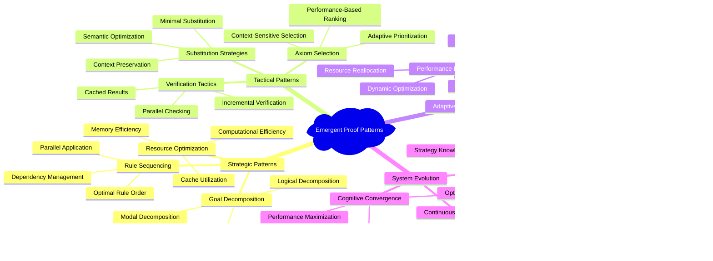

# Proof System Architecture and Verification Pipeline

## Sequent Calculus Architecture

The proof checker implements a sophisticated sequent calculus system for dL verification:


## Proof Construction Workflow

The system implements a sophisticated proof construction pipeline with adaptive reasoning:


## Differential Dynamic Logic Axiom System

The axiom system provides the foundational reasoning principles for hybrid systems:

```mermaid
graph TB
    %% Core DDL Axioms
    subgraph "Core DDL Axioms"
        ASSIGN[Assignment Axiom<br/>⟨x := e⟩P ↔ P[x/e]]
        ASSIGNANY[Nondeterministic Assignment<br/>⟨x := *⟩P ↔ ∀x P]
        TEST[Test Axiom<br/>⟨?Q⟩P ↔ Q ∧ P]
        CHOICE[Choice Axiom<br/>⟨α ∪ β⟩P ↔ ⟨α⟩P ∨ ⟨β⟩P]
        COMPOSE[Composition Axiom<br/>⟨α; β⟩P ↔ ⟨α⟩⟨β⟩P]
        LOOP[Loop Axiom<br/>⟨α*⟩P ↔ P ∨ ⟨α⟩⟨α*⟩P]
    end
    
    %% Differential Equation Axioms
    subgraph "Differential Equation Axioms"
        DIFFSYS[Differential System<br/>⟨{x' = f(x) & Q}⟩P]
        DIFFGHOST[Differential Ghost<br/>Differential Auxiliary Variables]
        DIFFWEAKEN[Differential Weakening<br/>Context Constraint Handling]
        DIFFCUT[Differential Cut<br/>Invariant Strengthening]
        DIFFINV[Differential Invariant<br/>⟨{x' = f(x) & Q}⟩P ← DI(P)]
    end
    
    %% Logical Axioms
    subgraph "Modal Logic Axioms"
        KMODAL[K Modal Axiom<br/>[α](P → Q) → ([α]P → [α]Q)]
        DUALDIAM[Dual Diamond<br/>⟨α⟩P ↔ ¬[α]¬P]
        VACUOUS[Vacuous Box<br/>[α]P if FV(P) ∩ BV(α) = ∅]
        MONOTONE[Monotonicity<br/>P → Q ⊢ [α]P → [α]Q]
    end
    
    %% Structural Rules
    subgraph "Structural Rules"
        CUT[Cut Rule<br/>Γ ⊢ P, Δ  P, Γ ⊢ Δ / Γ ⊢ Δ]
        WEAKEN[Weakening<br/>Γ ⊢ Δ / Γ, P ⊢ Δ]
        CONTRACT[Contraction<br/>Γ, P, P ⊢ Δ / Γ, P ⊢ Δ]
        EXCHANGE[Exchange<br/>Permutation of Hypotheses]
    end
    
    %% Axiom Relationships
    ASSIGN --> COMPOSE
    CHOICE --> COMPOSE
    LOOP --> COMPOSE
    
    DIFFSYS --> DIFFGHOST
    DIFFGHOST --> DIFFWEAKEN
    DIFFWEAKEN --> DIFFCUT
    DIFFCUT --> DIFFINV
    
    KMODAL --> DUALDIAM
    DUALDIAM --> VACUOUS
    VACUOUS --> MONOTONE
    
    CUT --> WEAKEN
    WEAKEN --> CONTRACT
    CONTRACT --> EXCHANGE
    
    %% Integration Points
    COMPOSE -.-> DIFFSYS
    DIFFINV -.-> MONOTONE
    EXCHANGE -.-> ASSIGN
    
    %% Styling
    classDef ddl fill:#e3f2fd
    classDef differential fill:#f3e5f5
    classDef modal fill:#e8f5e8
    classDef structural fill:#fff3e0
    
    class ASSIGN,ASSIGNANY,TEST,CHOICE,COMPOSE,LOOP ddl
    class DIFFSYS,DIFFGHOST,DIFFWEAKEN,DIFFCUT,DIFFINV differential
    class KMODAL,DUALDIAM,VACUOUS,MONOTONE modal
    class CUT,WEAKEN,CONTRACT,EXCHANGE structural
```

## Cognitive Proof Search Strategy

The system implements adaptive proof search with cognitive optimization:

```mermaid
stateDiagram-v2
    [*] --> ProofInitialization
    
    state ProofInitialization {
        [*] --> GoalAnalysis
        GoalAnalysis --> StrategySelection
        StrategySelection --> ResourceAllocation
        ResourceAllocation --> SearchInitiation
    }
    
    ProofInitialization --> AdaptiveSearch
    
    state AdaptiveSearch {
        [*] --> RuleSelection
        
        state RuleSelection {
            [*] --> PatternMatching
            PatternMatching --> ApplicabilityCheck
            ApplicabilityCheck --> PriorityRanking
            PriorityRanking --> RuleChoice
        }
        
        RuleSelection --> AxiomApplication
        
        state AxiomApplication {
            [*] --> AxiomMatching
            AxiomMatching --> InstantiationCheck
            InstantiationCheck --> SubstitutionPrep
            SubstitutionPrep --> AxiomIntegration
        }
        
        AxiomApplication --> SubstitutionPhase
        
        state SubstitutionPhase {
            [*] --> AdmissibilityAnalysis
            AdmissibilityAnalysis --> ContextValidation
            ContextValidation --> SemanticPreservation
            SemanticPreservation --> TransformationExecution
        }
        
        SubstitutionPhase --> VerificationPhase
        
        state VerificationPhase {
            [*] --> SoundnessVerification
            SoundnessVerification --> CompletenessCheck
            CompletenessCheck --> ValidityConfirmation
            ValidityConfirmation --> ProofStepValidation
        }
        
        VerificationPhase --> CognitiveOptimization
        
        state CognitiveOptimization {
            [*] --> PerformanceAnalysis
            PerformanceAnalysis --> StrategyAdaptation
            StrategyAdaptation --> ResourceReallocation
            ResourceReallocation --> SearchOptimization
        }
        
        %% Adaptive Transitions
        CognitiveOptimization --> RuleSelection: strategy_update
        VerificationPhase --> RuleSelection: proof_continuation
        RuleSelection --> AdaptiveSearch: recursive_descent
    }
    
    AdaptiveSearch --> ProofCompletion
    
    state ProofCompletion {
        [*] --> FinalVerification
        FinalVerification --> ProofObject
        ProofObject --> CertificateGeneration
        CertificateGeneration --> TraceProduction
    }
    
    ProofCompletion --> [*]
    
    %% Error Handling
    AdaptiveSearch --> ErrorRecovery: proof_failure
    ErrorRecovery --> AdaptiveSearch: strategy_revision
    ErrorRecovery --> [*]: unrecoverable_failure
```

## Verification Pipeline Architecture

The complete verification pipeline integrates all system components:


## Emergent Proof Patterns

The system develops emergent proof patterns through recursive learning:



This proof system architecture represents a sophisticated neural-symbolic integration where symbolic logical reasoning is enhanced by adaptive cognitive mechanisms, creating an emergent verification system that continuously improves its performance through recursive pattern recognition and strategy optimization.