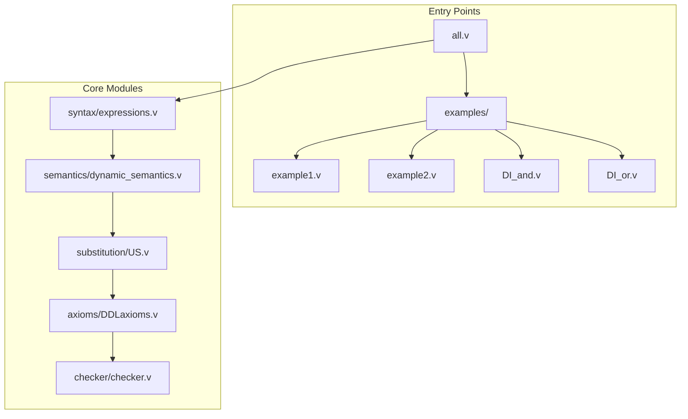
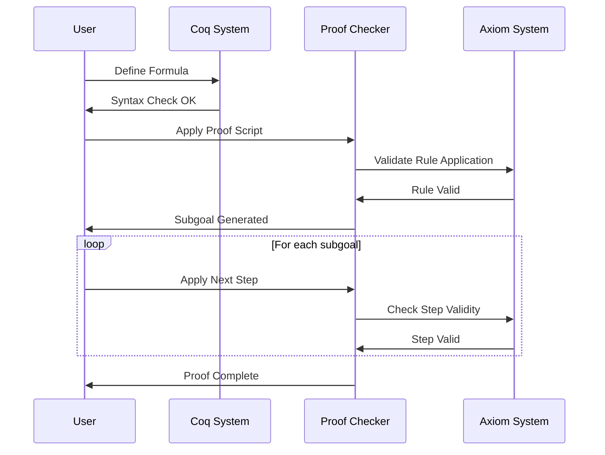
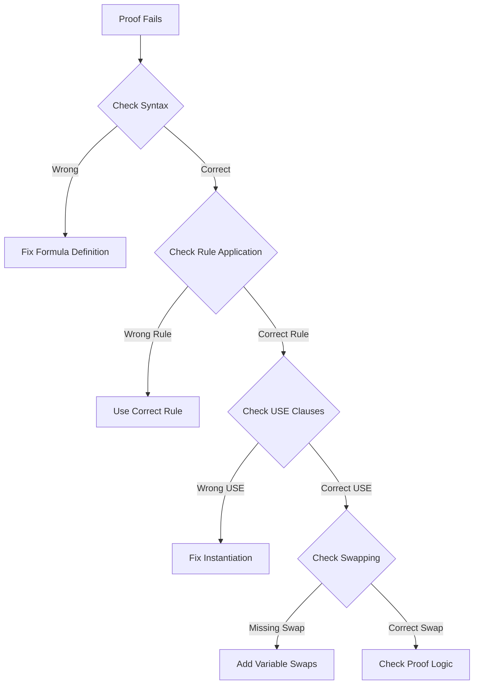

# OCoq-dL Usage Guide

## Table of Contents

1. [Getting Started](#getting-started)
2. [Writing Proofs](#writing-proofs)
3. [Proof Script Reference](#proof-script-reference)
4. [Common Patterns](#common-patterns)
5. [Troubleshooting](#troubleshooting)
6. [Advanced Usage](#advanced-usage)

## Getting Started

### Prerequisites

Ensure you have the required dependencies installed:
- Coq 8.9.1
- Coquelicot 3.0.2
- SSReflect (Math Components)

### Building the Project

```bash
# Clone the repository
git clone https://github.com/OpenCoq/OCoq-dL.git
cd OCoq-dL

# Generate Makefile and build
./create_makefile.sh
make -j 4  # Use 4 cores for parallel compilation

# Verify build succeeded
coqc all.v
```

### Project Structure Navigation



## Writing Proofs

### Basic Proof Structure

A typical proof in OCoq-dL follows this pattern:

```coq
Definition MyFormula : Formula := 
  (* Define your dL formula here *).

Lemma MyFormula_sequent_true : sequent_true (MkSeq emHyps MyFormula).
Proof.
  unfold MyFormula.
  apply sequent_true_as_sound_proof_state.
  apply (apply_script_preserves_soundness
    [step1, step2, step3, ...]).
  (* Discharge any remaining goals *)
Qed.
```

### Example: Simple Safety Property

```coq
(* v≥0 → [x:=x+v] x≥0 *)
Definition SimpleAssignment : Formula :=
  KFimply
    (KFgreaterEqual (KTread varv) (KTnumber 0))
    (KFbox
      (KPassign varx (KTplus (KTread varx) (KTread varv)))
      (KFgreaterEqual (KTread varx) (KTnumber 0))).

Lemma SimpleAssignment_proof : sequent_true (MkSeq emHyps SimpleAssignment).
Proof.
  unfold SimpleAssignment.
  apply sequent_true_as_sound_proof_state.
  apply (apply_script_preserves_soundness
    [step_imply_right "H1",
     step_assign "H2" [USE_function funcf 1 (KTplus (KTread varx) (KTread varv))],
     step_assumption "H1"]).
  (* Proof complete *)
Qed.
```

### Proof Workflow



## Proof Script Reference

### Basic Steps

#### Propositional Logic

```coq
step_imply_right "H"          (* A → B ⊢ from A ⊢ B *)
step_imply_left "H"           (* ⊢ A → B from ⊢ A and B ⊢ *)
step_and_left "H1" "H2"       (* A ∧ B ⊢ from A, B ⊢ *)
step_and_right "H"            (* ⊢ A ∧ B from ⊢ A and ⊢ B *)
step_or_left "H"              (* A ∨ B ⊢ from A ⊢ and B ⊢ *)
step_or_right "H"             (* ⊢ A ∨ B from ⊢ A or ⊢ B *)
step_not_left "H"             (* ¬A ⊢ from ⊢ A *)
step_not_right "H"            (* ⊢ ¬A from A ⊢ *)
```

#### Program Logic

```coq
step_assign "H" [uses]        (* Assignment axiom *)
step_test "H"                 (* Test program *)
step_choice "H"               (* Nondeterministic choice *)
step_compose "H"              (* Sequential composition *)
step_loop "H"                 (* Kleene star / iteration *)
```

#### Differential Logic

```coq
step_DI "H" [uses] [swaps]    (* Differential Invariant *)
step_DC "H" [uses] [swaps]    (* Differential Cut *)
step_DG "H" [uses] [swaps]    (* Differential Ghost *)
step_DE "H" [uses] [swaps]    (* Differential Effect *)
step_OC "H" [uses] [swaps]    (* ODE Characterization *)
```

### Parameter Specifications

#### USE Clauses

```coq
USE_function f arity term     (* Instantiate function symbol *)
USE_pred p arity formula      (* Instantiate predicate symbol *)
USE_ode c ode                 (* Instantiate ODE constant *)
USE_prog p program            (* Instantiate program constant *)
USE_quant q formula           (* Instantiate quantifier *)
```

#### Variable Swapping

```coq
MkSwapping var1 var2          (* Swap variables var1 and var2 *)
```

### Advanced Steps

```coq
step_spDGhostLR "H" [uses] [swaps]  (* Spatial Differential Ghost *)
step_equiv_left "H1" "H2"           (* Equivalence left *)
step_equiv_right "H"                (* Equivalence right *)
step_focus n                        (* Focus on nth subgoal *)
step_clear "H"                      (* Clear hypothesis H *)
step_assumption "H"                 (* Use assumption H *)
```

## Common Patterns

### Safety Properties

For proving safety properties of the form `P → [α]Q`:

```mermaid
graph TD
    A[P → [α]Q] --> B[step_imply_right]
    B --> C{Program α Type?}
    C -->|Assignment| D[step_assign]
    C -->|ODE| E[step_DI]
    C -->|Choice| F[step_choice]
    C -->|Composition| G[step_compose]
    D --> H[Arithmetic Goal]
    E --> I[Differential Invariant]
    F --> J[Multiple Subgoals]
    G --> K[Sequential Subgoals]
```

### Differential Invariants

For ODE systems with invariants:

```coq
(* Pattern: P → [x'=f(x)&Q]P *)
step_imply_right "init"
step_DI "inv" 
  [USE_function funcf arity term,
   USE_pred predQ arity constraint]
  []
(* Then prove: P → P' where P' is differential of P *)
```

### Inductive Loop Invariants

For loops with invariants:

```coq
(* Pattern: I → [α*]P where I is loop invariant *)
step_imply_right "init"
step_loop "inv"
step_imply_right "body"
(* Prove I → [α]I and I → P *)
```

## Troubleshooting

### Common Errors

#### "Admissibility condition failed"
- **Cause**: Variable capture in uniform substitution
- **Solution**: Use fresh variables or add swapping clauses

#### "Rule not applicable"
- **Cause**: Wrong rule for formula structure
- **Solution**: Check formula syntax and use appropriate rule

#### "Unification failed"
- **Cause**: USE clauses don't match expected pattern
- **Solution**: Verify function/predicate arities and types

### Debug Strategies



### Useful Tactics

```coq
(* Show current goal structure *)
Show.

(* Print definition *)
Print MyFormula.

(* Check type *)
Check MyFormula.

(* View proof state *)
goal.
```

## Advanced Usage

### Custom Axioms

To add custom axioms:

1. Define the axiom in appropriate axiom file
2. Prove soundness
3. Add to proof checker
4. Create test cases

```coq
(* Example custom axiom *)
Definition my_axiom : Formula := 
  (* axiom definition *).

Lemma my_axiom_sound : 
  valid my_axiom.
Proof.
  (* soundness proof *)
Qed.
```

### Extended Proof Automation

```coq
(* Create tactic for common patterns *)
Ltac solve_assignment := 
  step_imply_right "H";
  step_assign "G" [USE_function funcf 1 (KTread varx)];
  step_assumption "H".

(* Use in proofs *)
Lemma assignment_example : 
  sequent_true (MkSeq emHyps assignment_formula).
Proof.
  unfold assignment_formula.
  apply sequent_true_as_sound_proof_state.
  solve_assignment.
Qed.
```

### Performance Optimization

For large proofs:

1. Use `step_focus` to work on specific subgoals
2. Clear unnecessary hypotheses with `step_clear`
3. Factor common subproofs into lemmas
4. Use parallel compilation with `make -j`

### Integration with External Tools

The checker can potentially integrate with:
- KeYmaeraX for proof import/export
- SMT solvers for arithmetic goals
- Model checkers for finite state verification

This usage guide provides practical guidance for working with the OCoq-dL proof system, from basic proof construction to advanced customization.