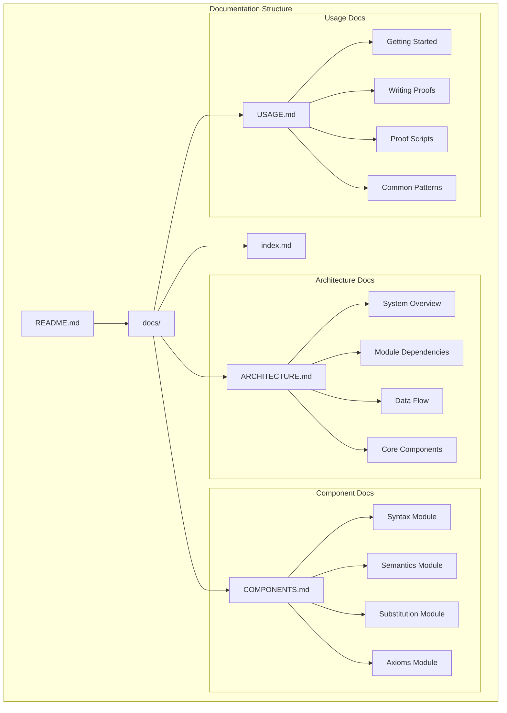
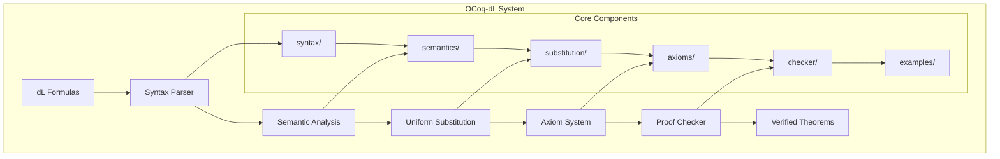

# OCoq-dL Documentation

Welcome to the comprehensive documentation for OCoq-dL, a formal verification system implementing differential dynamic logic (dL) in Coq.

## Documentation Overview

This documentation provides complete technical architecture details, component references, and usage guides for the OCoq-dL system.

## Quick Start

1. **New Users**: Start with [USAGE.md](USAGE.md) for installation and basic proof writing
2. **Developers**: Read [ARCHITECTURE.md](ARCHITECTURE.md) for system overview and design
3. **Contributors**: See [COMPONENTS.md](COMPONENTS.md) for detailed module documentation

## Document Contents

### [ARCHITECTURE.md](ARCHITECTURE.md)
Comprehensive technical architecture documentation with mermaid diagrams covering:
- System overview and high-level architecture  
- Module dependencies and relationships
- Data flow through the verification pipeline
- Core component details and interactions
- Proof workflow and verification process
- Extension guidelines for adding new features
- Build system and development environment

### [COMPONENTS.md](COMPONENTS.md)
Detailed reference documentation for each system component:
- **Syntax Module**: AST definitions for terms, formulas, programs, ODEs
- **Semantics Module**: Static and dynamic semantics implementation
- **Substitution Module**: Uniform substitution and admissibility checking
- **Axioms Module**: DDL axioms, ODE axioms, and proof rules
- **Checker Module**: Sequent calculus and proof verification
- **Examples Module**: Sample proofs and verification cases

### [USAGE.md](USAGE.md)
Practical guide for using the OCoq-dL system:
- Installation and setup instructions
- Writing and structuring proofs
- Proof script reference and command documentation
- Common proof patterns and techniques
- Troubleshooting guide and debugging strategies
- Advanced usage and customization

## System Architecture Overview

## Key Features

- **Complete dL Formalization**: Full syntax and semantics for differential dynamic logic
- **Verified Axiom System**: Soundness-proven axioms for DDL and ODE reasoning
- **Uniform Substitution**: Mechanized uniform substitution with admissibility checking
- **Proof Checker**: Interactive proof construction with sequent calculus
- **Example Library**: Comprehensive examples demonstrating verification techniques

## Research Context

OCoq-dL implements the theoretical foundations described in:

- [Formally verified differential dynamic logic](http://dx.doi.org/10.1145/3018610.3018616) (CPP 2017)
- [A Complete Uniform Substitution Calculus for Differential Dynamic Logic](http://arxiv.org/pdf/1601.06183.pdf) (Technical Report)

The system provides a mechanized foundation for:
- Hybrid system verification
- Cyber-physical system safety analysis  
- Differential dynamic logic theorem proving
- Formal methods education and research

## Contributing

To contribute to OCoq-dL:

1. Read the [ARCHITECTURE.md](ARCHITECTURE.md) to understand the system design
2. Review [COMPONENTS.md](COMPONENTS.md) for implementation details
3. Follow [USAGE.md](USAGE.md) to set up your development environment
4. Study existing examples in the `examples/` directory
5. Add new axioms, extend syntax, or improve the proof checker following the extension guidelines

## Support

For questions, issues, or contributions:
- Create issues on the GitHub repository
- Follow the documentation for troubleshooting
- Contact the maintainers listed in the main README

This documentation is maintained alongside the codebase to ensure accuracy and completeness.